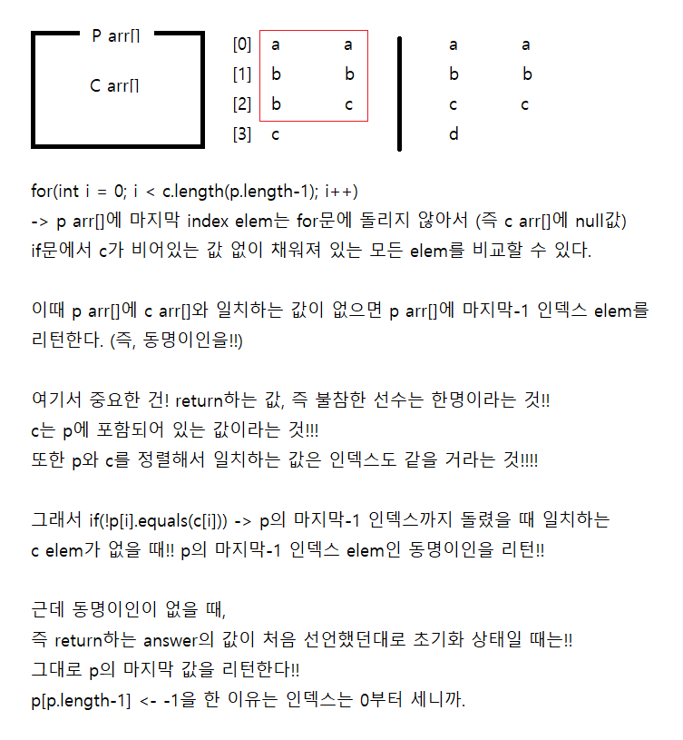

```java
import java.util.Arrays;
class Solution {
    public String solution(String[] p, String[] c) {
        String answer = "";
        Arrays.sort(p);
        Arrays.sort(c);
        for(int i = 0; i < c.length; i++){
            if(!p[i].equals(c[i])){
                return p[i];
            }
        }
        if (answer == ""){
            answer = p[p.length-1];
        }
        return answer;
    }
}
```

